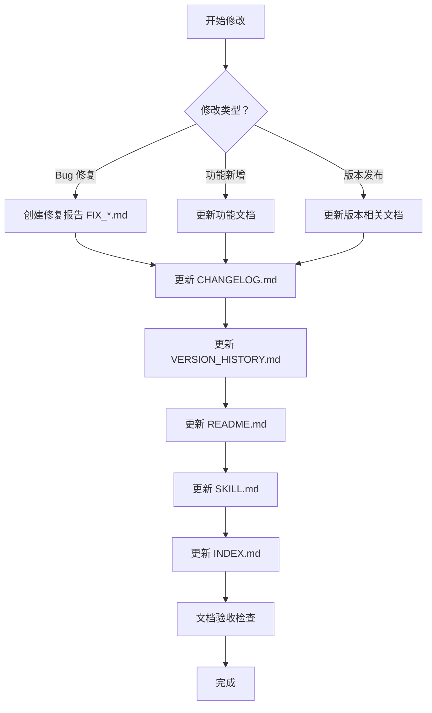

# 文档维护规范

**版本**: V1.0  
**生效日期**: 2026-04-15  
**状态**: ✅ 强制执行

---

## 🎯 核心原则

> **每一次修改，都应该记录下来。**  
> **每一次变更，相关文档都需要同步更新。**

---

## 📝 文档更新清单

### 每次修改必须更新的文档

| 优先级 | 文档 | 更新条件 | 必填内容 |
|--------|------|----------|----------|
| 🔴 **P0** | `docs/CHANGELOG.md` | **每次修改** | 修改内容、影响范围、日期 |
| 🔴 **P0** | `docs/VERSION_HISTORY.md` | **版本发布** | 版本号、核心变更、修改文件 |
| 🔴 **P0** | `README.md` | **版本发布** | 版本号、更新日期、更新日志 |
| 🔴 **P0** | `SKILL.md` | **功能变更** | 版本号、功能表、说明 |
| 🟡 **P1** | `docs/INDEX.md` | **新增文档** | 文档索引、分类 |
| 🟡 **P1** | `docs/FIX_*.md` | **Bug 修复** | 问题描述、修复方案、测试结果 |

---

## 🔄 文档更新流程

### 标准流程



### 检查清单

**修改完成后，逐项检查**:

- [ ] **CHANGELOG.md** - 添加更新记录
- [ ] **VERSION_HISTORY.md** - 添加版本记录（如发布版本）
- [ ] **README.md** - 更新版本号和更新日志
- [ ] **SKILL.md** - 更新版本号和功能表
- [ ] **INDEX.md** - 更新文档索引（如有新文档）
- [ ] **相关技术文档** - 更新受影响的模块文档
- [ ] **文档一致性检查** - 版本号、日期、描述一致
- [ ] **链接检查** - 所有内部链接有效

---

## 📊 修改类型与文档对应关系

### Bug 修复

| 修改内容 | 必更文档 | 选更文档 |
|----------|----------|----------|
| 代码 Bug 修复 | `CHANGELOG.md` | `FIX_*.md` |
| 数据源修复 | `CHANGELOG.md` + `DATA_SOURCES.md` | `FIX_*.md` |
| 预测逻辑修复 | `CHANGELOG.md` + `ANALYZERS.md` | `FIX_*.md` |
| 界面展示修复 | `CHANGELOG.md` | `FIX_*.md` |

### 功能新增

| 修改内容 | 必更文档 | 选更文档 |
|----------|----------|----------|
| 新分析器 | `CHANGELOG.md` + `ANALYZERS.md` | `ARCHITECTURE.md` |
| 新数据源 | `CHANGELOG.md` + `DATA_SOURCES.md` | - |
| 新预测器 | `CHANGELOG.md` + `ANALYZERS.md` | - |
| 新接口 | `CHANGELOG.md` + `README.md` | - |

### 版本发布

| 修改内容 | 必更文档 |
|----------|----------|
| 小版本 (x.y.z) | `CHANGELOG.md` |
| 次版本 (x.Y.0) | `CHANGELOG.md` + `VERSION_HISTORY.md` + `README.md` + `SKILL.md` |
| 主版本 (X.0.0) | 所有核心文档 + 创建迁移指南 |

---

## ✍️ 文档编写规范

### CHANGELOG.md 格式

```markdown
## [V8.4.5] - 2026-04-15

### 🔴 高优先级修复

#### ✨ 功能名称
- **变更**: 具体变更内容
- **原因**: 为什么要改
- **影响**: 影响范围

**修改文件**:
- `path/to/file.py` - 修改说明

**效果对比**:
```
修复前：xxx
修复后：xxx
```
```

### VERSION_HISTORY.md 格式

```markdown
## V8.4.5 (2026-04-15) - 版本名称

**发布日期**: 2026-04-15  
**状态**: ✅ 生产就绪

### 核心变更

#### 1. 变更名称
- 变更点 1
- 变更点 2

**修改文件**:
- `file1.py`
- `file2.py`

### 📊 效果对比

| 指标 | 修复前 | 修复后 | 改善 |
|------|--------|--------|------|
| 指标 1 | xxx | xxx | ✅ |
```

### 修复报告格式

```markdown
# 修复报告：问题名称

**日期**: YYYY-MM-DD  
**版本**: Vx.y.z  
**状态**: ✅ 已完成

## 🐛 问题描述

问题现象、影响范围、复现步骤

## 🔍 根本原因

问题分析、日志证据

## ✅ 修复方案

修改内容、代码对比

## 📊 修复效果

测试数据、效果对比

## 📝 修改文件

| 文件 | 修改内容 | 行数变化 |
|------|----------|----------|
| `file.py` | 说明 | +N 行 |
```

---

## 🔍 文档验收标准

### 一致性检查

| 检查项 | 标准 | 验证方法 |
|--------|------|----------|
| 版本号 | 所有文档一致 | `grep -r "V8.4.5" *.md docs/*.md` |
| 更新日期 | 核心文档一致 | 检查 README/SKILL/VERSION_HISTORY |
| 功能描述 | 多处描述一致 | 对比 README/SKILL/技术文档 |
| 文件清单 | 修改记录完整 | 对比实际 git diff |

### 质量检查

| 检查项 | 标准 |
|--------|------|
| 标题清晰 | 包含版本号和日期 |
| 内容完整 | 问题/方案/效果三要素 |
| 格式规范 | Markdown 表格、代码块 |
| 链接有效 | 所有内部链接可访问 |
| 交叉引用 | 相关文档互相引用 |

---

## 📋 文档维护日历

### 日常维护

| 频率 | 任务 | 负责人 |
|------|------|--------|
| 每次提交 | 更新 CHANGELOG.md | 开发者 |
| 每次修复 | 创建修复报告 | 开发者 |
| 每周检查 | 文档链接有效性 | 维护者 |

### 版本发布

| 频率 | 任务 | 负责人 |
|------|------|--------|
| 小版本 | 更新 CHANGELOG.md | 开发者 |
| 次版本 | 更新所有核心文档 | 维护者 |
| 主版本 | 完整文档审查 + 迁移指南 | 团队 |

---

## 🎯 文档覆盖率目标

| 模块 | 目标覆盖率 | 当前状态 |
|------|-----------|----------|
| 核心功能 | 100% | ✅ |
| 数据源 | 100% | ✅ |
| 分析器 | 100% | ✅ |
| 预测器 | 100% | ✅ |
| 展示层 | 100% | ✅ |
| 修复记录 | 100% | ✅ |
| API 接口 | 100% | ✅ |

---

## ⚠️ 常见错误与避免方法

### 错误 1: 忘记更新版本号

**现象**: 代码已发布，文档还是旧版本

**避免方法**:
1. 发布前执行 `grep -r "version" *.md docs/*.md`
2. 使用版本号检查脚本
3. 加入 CI/CD 检查流程

### 错误 2: 文档描述不一致

**现象**: README 和功能文档描述不同

**避免方法**:
1. 建立单一信息源（SKILL.md）
2. 其他文档引用而非复制
3. 定期审查文档一致性

### 错误 3: 修复记录缺失

**现象**: 问题修复了，但没记录原因和方案

**避免方法**:
1. 强制要求创建修复报告
2. 修复报告作为 PR 必需附件
3. 建立修复报告模板

---

## 🛠️ 文档维护工具

### 检查脚本

```bash
# 检查版本号一致性
#!/bin/bash
echo "检查版本号一致性..."
grep -h "version:" *.md docs/*.md | sort | uniq -c

# 检查更新日期
echo "检查更新日期..."
grep -h "最后更新\|last_updated" *.md docs/*.md | sort | uniq -c

# 检查死链接
echo "检查内部链接..."
find docs -name "*.md" -exec grep -l "\[.*\](.*.md)" {} \;
```

### 模板文件

- `docs/templates/FIX_REPORT_TEMPLATE.md` - 修复报告模板
- `docs/templates/VERSION_TEMPLATE.md` - 版本记录模板
- `docs/templates/CHANGELOG_ENTRY_TEMPLATE.md` - 更新日志模板

---

## 📖 培训与传承

### 新成员入职

1. 阅读本文档维护规范
2. 学习现有文档结构和风格
3. 完成一次完整的文档更新练习
4. 通过文档质量审查

### 知识传承

1. 文档维护经验记录
2. 最佳实践案例收集
3. 常见问题 FAQ 维护
4. 定期文档审查会议

---

## 🎉 文档质量奖励

### 优秀文档标准

- ✅ 内容完整准确
- ✅ 格式规范统一
- ✅ 更新及时同步
- ✅ 易于理解导航
- ✅ 示例清晰实用

### 奖励机制

- 月度文档质量奖
- 最佳修复报告奖
- 文档贡献排行榜

---

**生效日期**: 2026-04-15  
**维护者**: Macro Investment Assistant Team  
**审查周期**: 每季度一次

---

## 📝 附录：文档更新检查清单模板

```markdown
## 文档更新检查清单

**修改 PR**: #XXX  
**修改内容**: 简述修改内容  
**修改日期**: YYYY-MM-DD

### 必更文档

- [ ] `docs/CHANGELOG.md` - 添加更新记录
- [ ] `docs/VERSION_HISTORY.md` - 添加版本记录（如适用）
- [ ] `README.md` - 更新版本号和日志（如适用）
- [ ] `SKILL.md` - 更新版本号和功能表（如适用）
- [ ] `docs/INDEX.md` - 更新文档索引（如适用）

### 相关技术文档

- [ ] `docs/ANALYZERS.md` - 如修改分析器
- [ ] `docs/DATA_SOURCES.md` - 如修改数据源
- [ ] `docs/ARCHITECTURE.md` - 如修改架构
- [ ] 其他相关文档...

### 修复报告

- [ ] 创建 `docs/FIX_YYYYMMDD_*.md`（如为 Bug 修复）

### 质量检查

- [ ] 版本号一致性检查
- [ ] 更新日期一致性检查
- [ ] 功能描述一致性检查
- [ ] 内部链接有效性检查
- [ ] 交叉引用正确性检查

### 验收人

- [ ] 自审：__________ 日期：__________
- [ ] 互审：__________ 日期：__________
- [ ] 终审：__________ 日期：__________
```

---

*本文档应定期审查和更新，确保与实际工作流程保持一致。*
